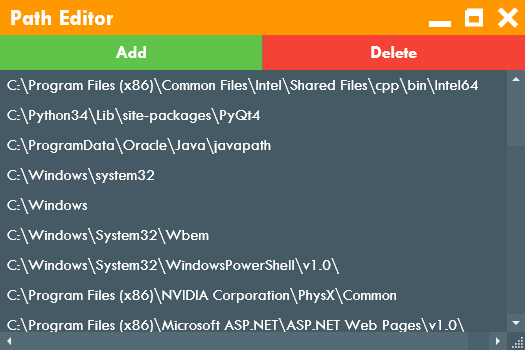

#  PATH Editor
This app lets you to edit a Windows PATH enviroment variable.
##

	  

 
<h5>Add Button</h5> Add directory to PATH variable
<h5>Delete Button</h5> Delete directory from PATH variable
<h5>Double click on element name</h5> Edit element
